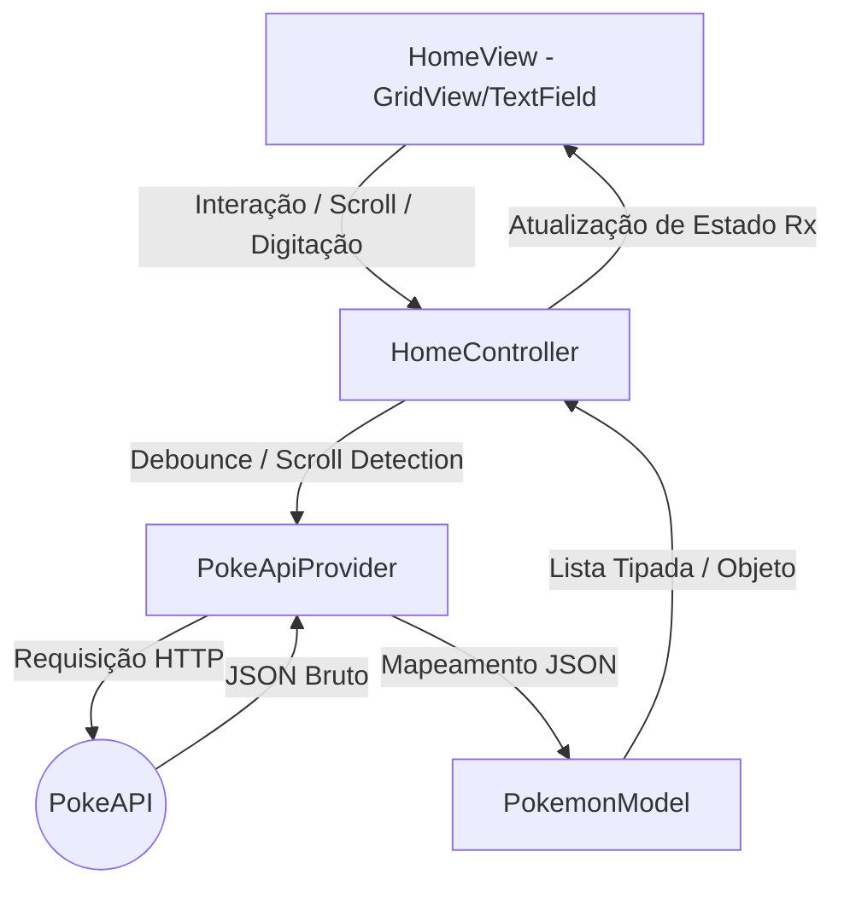

# 📝 Detalhamento da Implementação: Projeto FavDex

Este documento detalha tudo o que foi desenvolvido no projeto, como cada parte foi construída e as decisões arquiteturais tomadas. Este arquivo servirá como uma documentação evolutiva para explicar o código linha a linha de forma didática.

---

## 🚀 Fases 2 e 3: Camada de Dados e Tela de Busca (Home)

### 1. Camada de Dados e Modelagem
*   **`lib/data/models/pokemon_model.dart`** (Novo):
    *   Modelo de dados para representar um Pokémon.
    *   Possui duas estratégias de mapeamento através do construtor `fromJson`:
        1.  **Listagem Geral:** Extrai dinamicamente o `id` da URL do endpoint `/pokemon?limit=20` (já que a listagem inicial da PokeAPI não traz o ID diretamente) e monta a URL da arte oficial do Pokémon.
        2.  **Detalhes/Busca:** Mapeia propriedades complexas (como tipo, altura e peso) quando o JSON completo do Pokémon é fornecido.
*   **`lib/data/providers/poke_api_provider.dart`** (Modificado):
    *   Atualizado para parsear o JSON bruto da PokeAPI diretamente para objetos tipados `PokemonModel`.
    *   Adicionado o método `getPokemonByNameOrId(String query)` para buscar detalhes de um único Pokémon baseado no termo digitado pelo usuário.
    *   Foram adicionados `prints` para monitoramento das respostas puras da API no terminal.

### 2. Módulo de Busca / Home
*   **`lib/modules/home/home_view.dart`** (Novo):
    *   Constrói a interface com uma barra de busca moderna no topo e um `GridView` responsivo.
    *   Utiliza o widget `CachedNetworkImage` para carregar as fotos dos Pokémon sob demanda e salvá-las em cache local automaticamente.
*   **`lib/main.dart`** (Modificado):
    *   Configuração do roteamento inicial com `GetMaterialApp` e definição das rotas nomeadas (`/home`), associando o `HomeBinding` à rota para instanciar as dependências.

---

## 🛠️ Como foi Feito o Fluxo de Dados

O fluxo de dados e controle funciona da seguinte forma:



---

## 💡 Decisões de Design e Conceitos Injetados

### Importância e Uso dos Bindings (`HomeBinding`)
No GetX, um **Binding** é uma classe que centraliza a injeção de dependências para uma rota específica. O `HomeBinding` diz ao GetX quais recursos a `HomeView` precisa para funcionar.

*   **Implementação:** Em `lib/modules/home/home_binding.dart`, utilizamos `Get.lazyPut(() => PokeApiProvider())` e `Get.lazyPut(() => HomeController(Get.find()))`. O `Get.find()` instrui o GetX a automaticamente encontrar a instância do `PokeApiProvider` na memória e passá-la ao construtor do `HomeController`.
*   **Gerenciamento Inteligente de Memória:** Como usamos `Get.lazyPut`, os controladores só são criados na memória de fato quando o usuário abre a tela associada àquela rota. Assim que a tela é destruída, o GetX remove esses objetos da memória automaticamente, prevenindo *memory leaks* (vazamentos de memória).
*   **Desacoplamento:** A `HomeView` não precisa saber instanciar o `HomeController`. Ela declara `GetView<HomeController>` e foca apenas na renderização.

### O que é o `.obs` (Observables) e por que usamos?
No Flutter tradicional, se você alterar uma variável, você precisa chamar `setState(() {})` para reconstruir a tela. O GetX resolve isso usando **Programação Reativa**. Adicionar `.obs` ao final de uma variável a transforma em um **Observable**.

1.  **Envelopamento:** Ele converte um tipo primitivo (como `bool`, `String`) em uma classe do GetX (`RxBool`, `RxString`).
2.  **Monitoramento:** Essa classe "escuta" as mudanças de valor interno.
3.  **Atualização Cirúrgica:** Na interface, o widget `Obx(() => ...)` escuta essas variáveis. Se `isLoading.value` mudar, apenas o que está dentro do `Obx` reconstrói, preservando a performance.

---

## 🔍 Explicação Linha a Linha: `HomeController`

O `HomeController` (`lib/modules/home/home_controller.dart`) gerencia o estado da nossa tela principal.

### 1. Declaração das Variáveis Reativas

```dart
class HomeController extends GetxController {
  final PokeApiProvider provider;
  
  // Construtor: recebe a instância da API criada pelo HomeBinding
  HomeController(this.provider);

  // Variáveis Reativas (.obs)
  var pokemons = <PokemonModel>[].obs;       // Lista observável de Pokémon carregados
  var isLoading = false.obs;                 // Indica se a listagem infinita está carregando dados
  var isError = false.obs;                   // Indica se ocorreu algum erro na requisição
  var isSearchLoading = false.obs;           // Indica se a busca por texto está em andamento
  var hasReachedMax = false.obs;             // Impede requisições se já carregou todos os Pokémon
```
Sempre que `pokemons` sofre uma alteração, a Grid de cards na UI é atualizada instantaneamente.

### 2. Variáveis de Controle de Fluxo e Texto

```dart
  int _offset = 0;                           // Controla a partir de qual posição buscar (Ex: 0, 20, 40...)
  final int _limit = 20;                     // Quantidade de registros por página

  final searchController = TextEditingController(); // Controlador nativo do Flutter para o TextField
  final searchText = ''.obs;                 // String reativa que armazena o texto da busca para o debounce
```

### 3. Ciclo de Vida `onInit()` e Debounce

```dart
  @override
  void onInit() {
    super.onInit();
    fetchPokemons(); // Faz o primeiro carregamento ao iniciar a tela
    
    // Passa o texto do TextField para a nossa variável reativa
    searchController.addListener(() {
      searchText.value = searchController.text;
    });

    // DEBOUNCE: Impede travamento e sobrecarga de requisições
    debounce(
      searchText,            // Variável monitorada
      _performSearch,        // Função disparada
      time: const Duration(milliseconds: 800), // Atraso: espera o usuário parar de digitar por 800ms
    );
  }
```

### 4. Paginação (`fetchPokemons`)

```dart
  Future<void> fetchPokemons() async {
    // Ignora se já estiver carregando, chegou no fim ou se há um filtro de busca ativo
    if (isLoading.value || hasReachedMax.value || searchText.value.isNotEmpty) return;
    
    isLoading.value = true;
    isError.value = false;
    
    try {
      final newPokemons = await provider.fetchPokemonList(offset: _offset, limit: _limit);
      
      if (newPokemons.isEmpty) {
        hasReachedMax.value = true; // Marca que a API acabou
      } else {
        _offset += _limit; // Avança o ponteiro
        pokemons.addAll(newPokemons); // Insere no grid
      }
    } catch (e) {
      isError.value = true;
      Get.snackbar('Erro', 'Falha ao carregar Pokémon.');
    } finally {
      isLoading.value = false;
    }
  }
```
*   Esta função funciona em conjunto com o listener de scroll na UI. Quando o scroll chega perto do final, o `_offset` pede a próxima página, gerando o **Scroll Infinito**.

### 5. Busca Reativa (`_performSearch`)

```dart
  Future<void> _performSearch(String query) async {
    if (query.trim().isEmpty) {
      clearSearch(); // Se a busca estiver vazia, volta a paginação original
      return;
    }
    
    isSearchLoading.value = true; 
    
    try {
      final result = await provider.getPokemonByNameOrId(query.trim());
      
      pokemons.clear(); // Limpa a grade
      pokemons.add(result); // Mostra apenas o resultado pesquisado
      hasReachedMax.value = true; // Trava o scroll temporariamente
    } catch (e) {
      pokemons.clear();
      Get.snackbar('Não encontrado', 'Não conseguimos encontrar esse Pokémon.');
    } finally {
      isSearchLoading.value = false;
    }
  }
```

### 6. Limpar Busca (`clearSearch`)

```dart
  void clearSearch() {
    searchController.clear();
    searchText.value = '';     
    pokemons.clear();          
    _offset = 0;               
    hasReachedMax.value = false;
    fetchPokemons();           // Recarrega do zero
  }
```
*   Utilizado pelo botão "X" (clear) do TextField para desfazer a busca e voltar à grade normal de listagem.

---

## ❓ Diferença entre `isLoading` e `isSearchLoading`

No `HomeController`, temos dois estados booleanos reativos de carregamento separados: `isLoading` e `isSearchLoading`. Embora ambos indiquem que o app está esperando uma resposta da PokeAPI, eles controlam processos e comportamentos completamente diferentes na interface do usuário (UI):

### 1. `isLoading` (Carregamento da Listagem Geral / Paginação)
*   **O que controla:** O carregamento incremental da lista (paginação de 20 em 20 Pokémon).
*   **Como afeta a UI:** Quando `isLoading.value` é `true`, um indicador circular de progresso (Spinner) é exibido **no final da lista** (abaixo do GridView). A grade com os Pokémon que já foram carregados continua visível e navegável na tela.
*   **Objetivo:** Prover a experiência de "Infinite Scroll" (Rolagem Infinita), onde novos itens surgem no final da tela sem interromper a navegação do usuário.

### 2. `isSearchLoading` (Carregamento da Busca Específica)
*   **O que controla:** A busca ativa quando o usuário digita na barra de pesquisa para procurar um Pokémon específico por nome ou ID exato.
*   **Como afeta a UI:** Quando `isSearchLoading.value` é `true`, a lista atual de Pokémon é ocultada e um Spinner é exibido **centralizado na tela inteira**.
*   **Objetivo:** Indicar claramente ao usuário que o app está pesquisando pelo termo exato que ele acabou de digitar, limpando a tela anterior para evitar confusão visual entre a listagem antiga e o novo resultado único da busca.

---

## 🚀 Branch: `refactor/performance-api-home` (Resolução do problema N+1)

### O Problema Identificado
Após integrar os botões de filtros por Região da Pokédex (Kanto, Johto, etc.), a listagem principal do app foi modificada. O `HomeControlador` estava fazendo uma requisição HTTP para a lista de Pokémon e, em seguida, executando um *loop* (com `Future.wait`) disparando **20 requisições simultâneas adicionais** (uma para cada Pokémon) antes de exibir a grade na tela. 

*   **Lentidão e Bloqueio:** Conhecido como o problema das "Consultas N+1", isso forçava o celular a baixar muitos dados desnecessários na tela principal e causava lentidão, quebras de interface e chance de bloqueio do IP pela PokeAPI por excesso de requisições.
*   **Perda de Arquitetura:** O acesso direto via `http.get` de dentro do `HomeControlador` havia quebrado a separação de responsabilidades (já não passava pelo `PokeApiProvider`).

### A Solução Implementada

1.  **Recriação do `PokeApiProvider`:**
    *   Devolvemos todas as requisições HTTP para dentro do Provider.
    *   Criamos o método otimizado `fetchPokemonListFromUrl()`. Esse método identifica se a resposta vem do formato tradicional (`/pokemon`) ou do formato das Regiões (`/pokedex`) e unifica as listas sem fazer requisições pesadas aos detalhes.

2.  **Otimização Extrema do `PokemonModel.fromJson`:**
    *   O Modelo agora suporta duas formas de criação: **Resumo** e **Detalhado**.
    *   *Forma Resumo:* Quando montamos a tela principal (Home), a API só nos envia o "Nome" e a "URL" principal. Nós **fatiamos essa URL** para extrair o ID numérico (ex: `.../pokemon/25/` vira o ID `25`) e injetamos o ID manualmente no link de cache da imagem. Assim, geramos a foto e o nome instantaneamente, sem precisar daquela segunda chamada pesada.
    *   Tornamos atributos detalhados como `weight`, `height` e `hp` como **opcionais (anuláveis com `?`)**. Eles só serão preenchidos quando formos de fato para a `DetailsPage`.

3.  **Limpeza no Card e Controlador:**
    *   No `home_controlador.dart`, chamamos de forma reativa apenas o provider, injetando instantaneamente os dados.
    *   No `pokemon_cards.dart`, removemos a visualização estática do peso/altura (pois agora essas variáveis vêm nulas na listagem rápida). Adicionamos também o comando `capitalizeFirst` ao nome do Pokémon para deixar com aspecto Premium (Ex: `pikachu` vira `Pikachu`).

---

## 🚀 Branch: `feature/detalhes-pokemon` (Correção e Tela Completa)

### O Problema Identificado
A tela de detalhes (`DetailsBody`) estava quebrando a interface com uma tela amarela e preta de erro ("RenderFlex overflowed by 203 pixels na bottom"). 
Isso ocorreu porque:
1. Usamos a estrutura estática `Column` sem suporte à barra de rolagem.
2. Como otimizamos a página principal para não baixar peso/altura, os dados passados para a página de detalhes vinham nulos, exigindo que a tela buscasse essas informações na hora.

### A Solução Implementada

1.  **Criação do `DetailsController`:**
    *   Fizemos um controlador isolado (`lib/app/Details/details_controller.dart`) que captura o Pokémon enviado pela Home.
    *   Ao ser inicializado, ele dispara um comando para o `PokeApiProvider` buscando especificamente pelo nome do Pokémon.
    *   Assim que a PokeAPI responde, ele atualiza as variáveis da tela preenchendo todos os `stats`, `weight` e `height`.

2.  **Prevenção de Erros na Tela (`DetailsBody`):**
    *   Substituímos o envelopamento do cartão central por um **`SingleChildScrollView`**. Agora, independentemente do tamanho da tela do celular, o usuário pode fazer *scroll* pelos stats sem dar erro de RenderFlex.
    *   Ocultamos o cartão de detalhes e mostramos um `CircularProgressIndicator()` girando no centro até que o controlador termine de buscar os dados completos.

3.  **Design "Premium" com Barras de Progresso:**
    *   Removemos o empilhamento cru de textos (`Text('Hp: 45')`) e criamos o componente reusável `_buildStatRow`.
    *   Ele divide as informações em um formato visual de videogame, usando o widget `LinearProgressIndicator`, mostrando graficamente o poder de Ataque, Defesa e Velocidade de acordo com as cores clássicas de RPG.

---

## 🚀 Branch: `feature/search-page` (Página de Busca Dedicada)

### O Objetivo
Transformar o botão de "Configurações" na barra de navegação inferior em um botão de "Busca", direcionando o usuário para uma página dedicada de pesquisa de Pokémon.

### O Que Foi Desenvolvido

1.  **Refatoração do `BottomNavigationBar`:**
    *   No arquivo `bottoms.dart`, o botão "Configurações" foi substituído pelo botão de "Busca" com o ícone de lupa (`Icons.search`).
    *   Implementamos a lógica inteligente `Get.currentRoute` para garantir que o menu inferior sempre mostre a aba selecionada corretamente e use `Get.offAllNamed()` para evitar acumular telas na memória.

2.  **Criação do `SearchPokemonController`:**
    *   Um controlador isolado para a tela de buscas que gerencia o campo de texto (`TextEditingController`).
    *   Utiliza o método `provider.getPokemonDetails(query)` para bater na PokeAPI com o ID numérico (ex: `25`) ou o nome (ex: `pikachu`).
    *   Gerencia os estados reativos de `isLoading` (girando o loading spinner durante a requisição) e `errorMessage` (caso o Pokémon não exista).

3.  **Criação da `SearchPage`:**
    *   Uma tela contendo uma barra de pesquisa estilizada (`TextField` com bordas arredondadas e botão para limpar a busca).
    *   Um botão grande e destacado para disparar a busca.
    *   Na parte inferior, um grande container reativo (`Obx`) exibe:
        *   Mensagem de boas vindas, se nenhuma busca tiver sido feita.
        *   Loading, se a API estiver processando.
        *   Mensagem de erro vermelha se não for encontrado.
        *   O próprio `PokemonCard` (reaproveitado da tela Home) se a busca for bem sucedida!

4.  **Registro de Rotas Centralizadas:**
    *   A página de busca foi devidamente registrada no arquivo de rotas globais `app_pages.dart` sob o nome `'/search'`.

### Evolução da Navegação (IndexedStack)
Logo após criar a Busca, notamos que a navegação do rodapé causava um "redesenho" total da tela (fazendo até a barra superior piscar ou sumir). Para resolver isso e deixar as barras superior e inferior **fixas**:
*   Criamos o `MainPage` e `MainController` (`lib/modules/main/`).
*   Tornamos o `MainPage` a rota principal do app (`initialRoute: '/main'`).
*   Ele engloba um `Scaffold` que segura o `BottomNavigationBar` de forma fixa. No "meio" (o `body`), usamos um **`IndexedStack`**. 
*   O `IndexedStack` guarda a Home, Favoritos e Busca na memória ao mesmo tempo, apenas mudando qual delas está visível. Isso deixa a troca de abas instantânea, sem piscar a tela, dando uma cara totalmente profissional ao app!

### Visual Unificado e Premium (Global AppBar)
Em seguida, para garantir uma identidade visual consistente:
*   Removemos os `AppBars` antigos espalhados pelas telas e injetamos **um único `AppBar` global** dentro do `MainPage`.
*   Desenhamos um novo título "FAVDEX" centralizado, com fonte mais encorpada (`w900`), espaçamento (`letterSpacing`), e uma sombra sutil para dar um contraste elegante contra o fundo vermelho.
*   Mantivemos a inteligência: O menu de filtros de região (`PokedexLen`) só aparece na lateral esquerda quando o usuário está na aba da Home. Nas outras abas, ele desaparece sutilmente!
